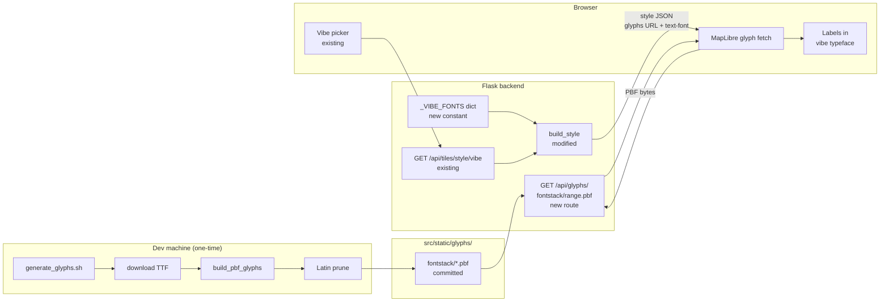

# Custom Fonts — Shaping

---

## Shape A: Offline PBF generation + Flask static serve

Generate glyph PBF files offline from TTF/OTF sources, serve them from Flask, override the `glyphs` URL and `text-font` per vibe in `style_builder.py`.

| Part | Mechanism | Flag |
|------|-----------|:----:|
| **A1** | **Offline PBF generation** | |
| A1 | `cargo install build_pbf_glyphs` (Rust, Stadia Maps, BSD-3). Run `build_pbf_glyphs /ttf_dir /output_dir` against TTF/OTF sources → 256 `.pbf` files per font. Then prune to Latin ranges: keep `0-255.pbf`, `256-511.pbf`, `512-767.pbf`, `8192-8447.pbf`, delete the rest. Output committed to repo. | |
| **A2** | **Flask static serve** | |
| A2 | Route at `/api/glyphs/{fontstack}/{range}.pbf` — reads pre-generated `.pbf` files from a static directory and serves them. No processing at request time. | |
| **A3** | **style_builder.py override** | |
| A3 | Per-vibe: override `glyphs` URL in style JSON to point to `/api/glyphs/...`. Override `text-font` in symbol layer `layout` properties for vibes with custom fonts. Vibes without custom fonts continue to point at OpenFreeMap's glyph server. | |
| **A4** | **Font selection** | |
| A4 | Choose one typeface per vibe from open-source candidates (OFL/Apache 2.0). All available as TTF from Google Fonts except OCR A Extended — see candidates table. | |
| **A5** | **Generation script** | |
| A5 | `scripts/generate_glyphs.sh` — downloads TTF from Google Fonts (or noted fallback), runs `build_pbf_glyphs`, prunes to Latin ranges, outputs to `src/static/glyphs/<fontstack>/`. PBF output committed to repo. No Rust required at runtime. | |

### Font candidates (from style-concepts.md + issue #2)

| Vibe | Candidate | Source | License |
|---|---|---|---|
| mario | Press Start 2P | Google Fonts | OFL 1.1 |
| simcity | Share Tech Mono | Google Fonts | OFL 1.1 |
| tomclancy | OCR A Extended | SourceForge `ocr-a-font` (not on Google Fonts) | Public Domain |
| deco | Poiret One | Google Fonts | OFL 1.1 |
| metro | IM Fell English Italic | Google Fonts | OFL 1.1 |
| mockva | Bebas Neue | Google Fonts | OFL 1.1 |
| vintage | IM Fell English | Google Fonts | OFL 1.1 |
| blueprint | Share Tech Mono | Google Fonts | OFL 1.1 |
| watercolor | Caveat | Google Fonts | OFL 1.1 |
| toner | Inter | Google Fonts | OFL 1.1 |
| dark | Space Grotesk | Google Fonts | OFL 1.1 |
| highcontrast | Atkinson Hyperlegible | Google Fonts | OFL 1.1 |

---

## Requirements (R)

| ID | Requirement | Status |
|----|-------------|--------|
| R0 | Each vibe can display map labels in a typeface matching its aesthetic | Core goal |
| R1 | Font rendering works in MapLibre GL JS (SDF PBF format required) | Must-have |
| R2 | Fonts served from this Flask app with no external CDN dependency at runtime — PBF files committed to repo | Must-have |
| R3 | Only open-source fonts (OFL or Apache 2.0) | Must-have |
| R4 | Vibes without custom fonts continue using the default OpenFreeMap glyph server unchanged | Must-have |
| R5 | PBF files cover Latin + basic punctuation only (~4–6 files per font, ~50–200KB total per font) | Must-have |
| R6 | PBF generation is reproducible via a committed script so fonts can be added or regenerated without archaeology | Must-have |
| R7 | At least one vibe ships as a working proof of concept before full rollout | Must-have |

---

## Detail A: Affordances and Wiring

### UI Affordances

| ID | Affordance | Place | Wires Out |
|----|------------|-------|-----------|
| U1 | Map labels rendered in vibe typeface | Browser | — (visual outcome) |
| U2 | Vibe picker (existing) | Browser | → N7 on change |

### Non-UI Affordances

| ID | Affordance | Place | Wires Out |
|----|------------|-------|-----------|
| N1 | `scripts/generate_glyphs.sh` | Dev machine (one-time) | → N2 |
| N2 | TTF download | Dev machine (Google Fonts / SourceForge) | → N3 |
| N3 | `build_pbf_glyphs /ttf_dir /out_dir` | Dev machine | → N4 |
| N4 | Latin prune (`find ... -delete`) | Dev machine | → N5 |
| N5 | `src/static/glyphs/<fontstack>/*.pbf` | Repo (committed static files) | → N6 |
| N6 | `GET /api/glyphs/<fontstack>/<range>.pbf` | Flask (new route) | reads N5 → Browser |
| N7 | `GET /api/tiles/style/<vibe>` | tiles.py (existing route) | → N8 |
| N8 | `build_style(vibe)` | style_builder.py (modified) | reads N9 → style JSON |
| N9 | `_VIBE_FONTS` dict | style_builder.py (new constant) | → N8 |

### Wiring by place

### Notes

- `_VIBE_FONTS` maps vibe name → fontstack name string (e.g. `'mockva': 'Bebas Neue Regular'`). Vibes not in the dict skip font override and keep the Liberty default glyph server.
- `build_style()` change: after applying colour overrides, if vibe is in `_VIBE_FONTS`, set `style['glyphs']` to our endpoint template and iterate symbol layers to set `layout['text-font']`.
- New glyph route: `send_from_directory(GLYPHS_DIR, f'{fontstack}/{range}.pbf', mimetype='application/x-protobuf')`. Return 404 if file not found — MapLibre silently falls back for missing ranges, which is correct for Latin-only sets.
- Route placement: `/api/glyphs/` prefix doesn't fit the existing `tiles_bp` (`url_prefix='/api/tiles'`). Options: (a) new `glyphs_bp` blueprint registered in `app.py`, or (b) keep in `tiles.py` with a URL override on the route. Decided at slicing.

---

## Fit Check: R × A

| Req | Requirement | Status | A |
|-----|-------------|--------|---|
| R0 | Each vibe can display map labels in a typeface matching its aesthetic | Core goal | ✅ |
| R1 | Font rendering works in MapLibre GL JS (SDF PBF format required) | Must-have | ✅ |
| R2 | Fonts served from this Flask app with no external CDN dependency at runtime — PBF files committed to repo | Must-have | ✅ |
| R3 | Only open-source fonts (OFL or Apache 2.0) | Must-have | ✅ |
| R4 | Vibes without custom fonts continue using the default OpenFreeMap glyph server unchanged | Must-have | ✅ |
| R5 | PBF files cover Latin + basic punctuation only (~4–6 files per font, ~50–200KB total per font) | Must-have | ✅ |
| R6 | PBF generation is reproducible via a committed script so fonts can be added or regenerated without archaeology | Must-have | ✅ |
| R7 | At least one vibe ships as a working proof of concept before full rollout | Must-have | ✅ |
