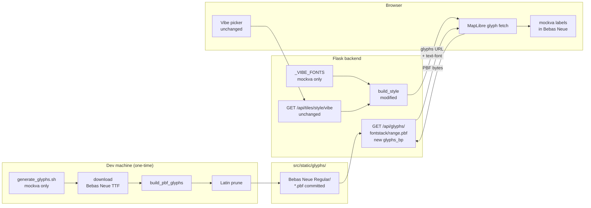

# Custom Fonts — Slices

Derived from `fonts-shaping.md` Detail A. Two vertical slices, each ending in demo-able UI.

---

## Open decision before V1: route placement

N6 (`GET /api/glyphs/<fontstack>/<range>.pbf`) needs a home. Two options:

- **Option (a):** New `glyphs_bp` Blueprint in `src/backend/glyphs.py`, registered in `app.py`. Clean separation, matches project pattern.
- **Option (b):** Add route directly to `tiles.py` with an explicit URL (`@tiles_bp.route('/glyphs/<fontstack>/<range>.pbf', endpoint='glyphs')` gives `/api/tiles/glyphs/...`). Simpler but URL doesn't match convention.

**Recommend (a)** — `glyphs_bp` in its own file. The glyph endpoint is conceptually separate from tile serving, and the URL `/api/glyphs/` is what we'll embed in the style JSON. Resolve before starting V1.

---

## V1: mockva proof of concept

**Goal:** Full pipeline working for one vibe. Every layer touched. Validates the approach before scaling.

**Demo:** Launch app → switch to mockva → labels render in Bebas Neue.

### Affordances in scope

| ID | Affordance | Action |
|----|------------|--------|
| N1 | `scripts/generate_glyphs.sh` | Create — mockva/Bebas Neue only |
| N2 | TTF download | Bebas Neue from Google Fonts |
| N3 | `build_pbf_glyphs` invocation | Run once for Bebas Neue |
| N4 | Latin prune | Keep `0-255.pbf`, `256-511.pbf`, `512-767.pbf`, `8192-8447.pbf` |
| N5 | `src/static/glyphs/Bebas Neue Regular/*.pbf` | Commit pruned PBFs |
| N6 | `GET /api/glyphs/<fontstack>/<range>.pbf` | Create — new `glyphs.py` + `glyphs_bp` |
| N8 | `build_style(vibe)` | Modify — add glyphs URL + text-font override logic |
| N9 | `_VIBE_FONTS` dict | Create — `{'mockva': 'Bebas Neue Regular'}` |

U2 (vibe picker) and N7 (style route) are unchanged — no action needed.

### Wiring

### Notes

- `generate_glyphs.sh` should be written to accept a font name argument from the start — makes V2 trivial (`./generate_glyphs.sh "Bebas Neue Regular" <url>`)
- MapLibre requests glyph ranges on demand; 404 for non-Latin ranges is correct and expected — MapLibre logs a warning but continues rendering
- Test with `python3 -m http.server` + minimal HTML before hooking into Flask (see spike findings)
- `app.py` change: `from .glyphs import glyphs_bp` + `app.register_blueprint(glyphs_bp)`

---

## V2: all remaining fonts

**Goal:** All vibes have their custom typeface. `generate_glyphs.sh` covers the full font list.

**Demo:** Switch through all vibes — each renders labels in its designated typeface.

### Affordances in scope

| ID | Affordance | Action |
|----|------------|--------|
| N1 | `scripts/generate_glyphs.sh` | Extend — add all remaining fonts |
| N2 | TTF downloads | 10 from Google Fonts, OCR A Extended from SourceForge |
| N3 | `build_pbf_glyphs` | Run for each remaining font |
| N4 | Latin prune | Same prune logic for each font |
| N5 | `src/static/glyphs/<fontstack>/*.pbf` | Commit PBFs for all remaining fonts |
| N9 | `_VIBE_FONTS` dict | Extend — add all remaining vibe → fontstack mappings |

N6, N7, N8 unchanged — glyph route and `build_style()` logic is already generic from V1.

### Fonts to add in V2

| Vibe | Fontstack name | Source |
|---|---|---|
| mario | Press Start 2P Regular | Google Fonts |
| simcity | Share Tech Mono Regular | Google Fonts |
| tomclancy | OCR A Extended Regular | SourceForge `ocr-a-font` |
| deco | Poiret One Regular | Google Fonts |
| metro | IM Fell English Italic | Google Fonts |
| vintage | IM Fell English Regular | Google Fonts |
| blueprint | Share Tech Mono Regular | Google Fonts (shared with simcity) |
| watercolor | Caveat Regular | Google Fonts |
| toner | Inter Regular | Google Fonts |
| dark | Space Grotesk Regular | Google Fonts |
| highcontrast | Atkinson Hyperlegible Regular | Google Fonts |

Note: `simcity` and `blueprint` share Share Tech Mono — generate PBFs once, add two entries in `_VIBE_FONTS` pointing to the same fontstack directory.

### Notes

- OCR A Extended: download TTF from `https://sourceforge.net/projects/ocr-a-font/files/latest/download` — unzip, locate the TTF, run `build_pbf_glyphs`. Document the source URL in `generate_glyphs.sh` comments.
- Total committed PBF size estimate: ~11 fonts × ~300 KB (Latin range) ≈ 3–4 MB. Acceptable for a git repo.
- After V2: `_VIBE_FONTS` covers all vibes. Vibes added in future (mario, simcity, tomclancy, etc. from style-concepts.md) just need their font in the dict — no code changes to the route or `build_style()`.
